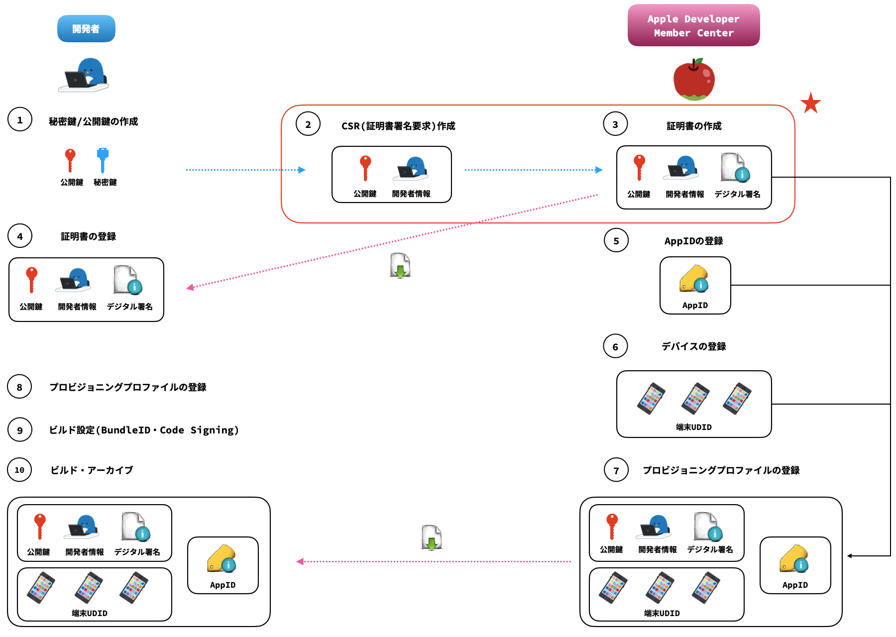
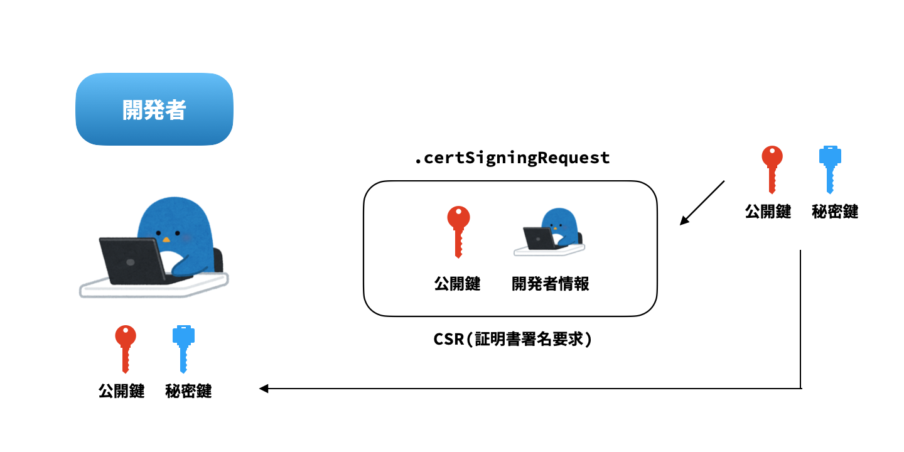
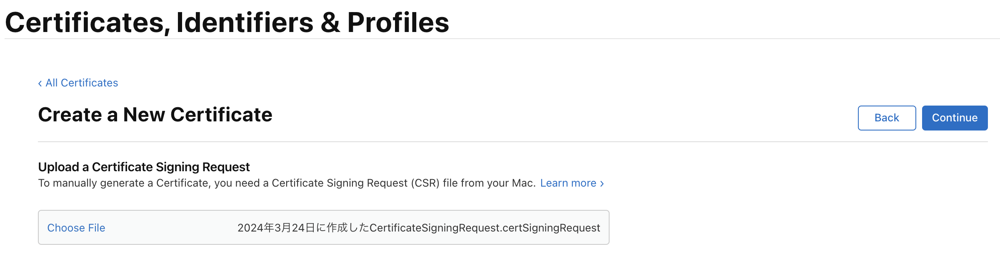

# iOSの証明書周りをイラストで読み解く 証明書作成編(CSR・証明書作成)

[前回](記事URL)はiOSの証明書周りを理解するための秘密鍵・公開鍵/コード署名編として、コード署名の中の流れやデジタル署名、デジタル証明書の仕組みについて読み解いていきました。

今回はiOS開発において必要なデジタル証明書を実際に作成しながら、必要な手順を読み解いていきます。

## 概要

デジタル証明書は、認証局を通して、公開鍵に自身の情報を含めたものでした。そして、認証局は開発者の公開鍵と開発者情報、その他関連情報を自身の秘密鍵で署名を行い、公開鍵・開発者情報・署名情報をまとめてデジタル証明書として発行します。

デジタル証明書を取得するためには、まずは申請するために必要な作業である証明書署名要求(CSR: Certificate Signing Request)の作成を行います。

### CSR

CSRは、いわゆる自身の公開鍵と開発者情報を認証局に送るための準備になります。また、CSRは`.certSigningRequest`ファイル形式で生成されます。

では、実際にCSRを作成してみましょう。

#### CSR作成

1. キーチェーンアクセス → 証明書アシスタント → 認証局に証明書を要求

2. CSRに必要な情報を入力、ローカルマシンに保存

3. 鍵ペア情報入力

CSRの作成の際には、自身の公開鍵と秘密鍵のペアが作成され、ローカルマシン内のキーチェーンに保存されます。鍵はCSR作成の通称で設定した名前で生成されます。

CSRの作成が完了したので、次はこのCSRを使ってAppleの認証局を通じてデジタル証明書の発行をしていきましょう。

### デジタル証明書

iOSにおいては、認証局はApple Root Certification Authorityとなり、作成したCSRを提出することでデジタル証明書が発行されます。

では、実際にデジタル証明書を発行してみましょう。

#### デジタル証明書発行

1. Apple Developer Programから証明書(Certificates＋)選択 → 証明書作成用途に応じて証明書選択

2. 作成したCSRを選択

3. 発行された証明書をローカルマシンにダウンロード

これでコード署名で使われるデジタル証明書の発行まですることができました。

## まとめ

iOSにおける認証局のApple Root Certification Authorityを通じて、デジタル証明書の発行までを実際にローカルマシンで追いながら確認することができました。

次回は、ローカルマシン上でのデジタル証明書の登録、秘密鍵との紐付きについて読み解いていきます。

## 参考文献

[Xcode と署名](https://scrapbox.io/tasuwo-ios/Xcode_%E3%81%A8%E7%BD%B2%E5%90%8D)

[iOSアプリのプロビジョニング周りを図にしてみる](https://qiita.com/fujisan3/items/d037e3c40a0acc46f618)

[iOSのコード署名がなんのためにどうやって行われているかを理解する](https://qiita.com/maiyama18/items/88567365dde2a3b3cc92#%E3%82%B3%E3%83%BC%E3%83%89%E7%BD%B2%E5%90%8D%E3%81%AE%E7%99%BB%E5%A0%B4%E4%BA%BA%E7%89%A9)