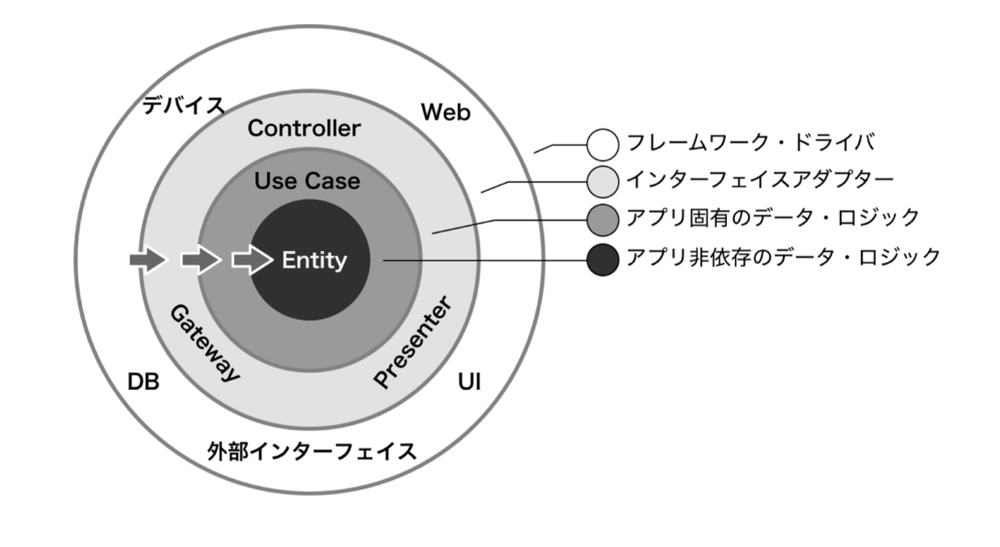
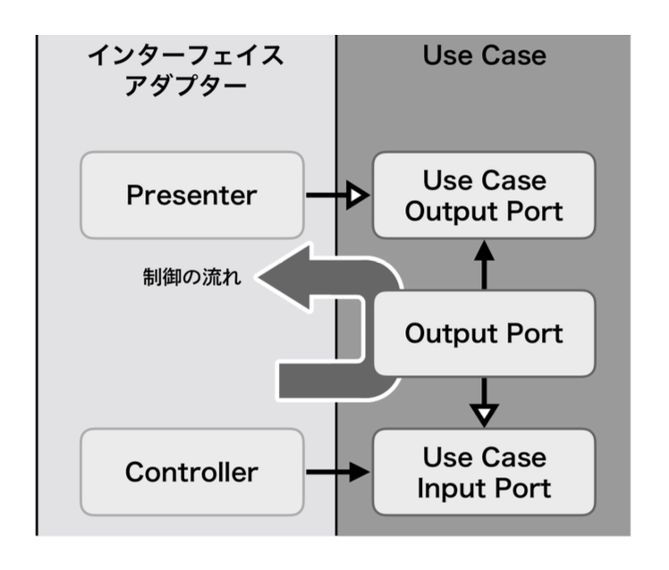
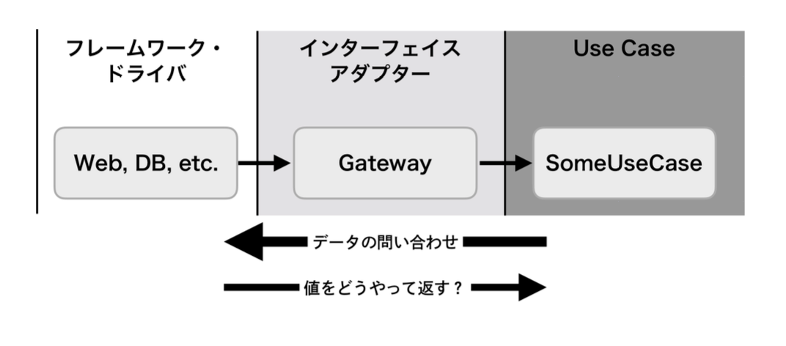

# Clean Architecture



## 概要

**システムアーキテクチャ(UIだけでなくアプリケーション全体、つまりModelの内部表現にまで踏み込んだアーキテクチャパターン)**

* あるシステムの1機能を実現するアプリケーションを考える時、その実現する機能の領域(ドメイン)と技術の詳細に注目し、アプリケーションを4つのコンポーネントに分ける
  * **Entity**: アプリケーションに依存しない、ドメインに関するデータ構造やビジネスロジック
  * **UseCase**: アプリケーションで固有なロジック
  * **インターフェースアダプター**: UseCase・フレームワークとドライバで使われるデータ構造を互いに変換する
  * **フレームワークとドライバ**: データベース(DB)、Webなどのフレームワークやツールの「詳細」

* 4つが同心円状になるよう配置する(依存の方向を外から内への一方向に厳密に定める)
  * **Entity**: 最も純粋で他に依存がないものを中心に配置
  * **UseCase**: Entityの外側に配置
  * **インターフェースアダプター**: 内外の変換層としてUseCaseと最外層の間に配置
  * **データベース/Web/OS**: 移植や技術変遷で変わりやすいものを最外周に配置

### メリット

* この構造を維持してアプリケーションを作ることで、変わりやすい部分を変えやすく、維持しておきたい部分はそのままにしやすくできる

* 内側にあるEntityやUseCaseは外側のWebAPIサーバーやデバイスドライバなどに依存していないので、それらの完成を待つことなくロジックをテストできる

* iOSだけでなくAndroidでも同時に開発するときに、ビジネスロジックなどOS非依存の部分を同じように書くことで保守性を高めることができる

### レイヤードアーキテクチャとの比較

* レイヤードアーキテクチャ
  * データベースなどの永続化を担う層がドメインを担当する層の下にいて、ドメインが永続化層に依存している

* Clean Architecture
  * データベースを円の外側に置き、依存の方向が逆転している
  * データベースとUseCaseの間に変換層を挟み、切り替えが容易な仕組みを持っている

### Entity

**処理の方法に依存しないビジネスロジックでデータ構造やメソッドの集合体**

* 外側に層に依存しないため、UseCaseや他の層によってどのように使われるかを気にしない
  * 例) 銀行がローンにN%の利子を付けているとすると、それは銀行のお金を生むためのビジネスルールとなる。利子をコンピュータで計算しようと、そろばんで計算しようと、全く関係ない
    * 利子を計算するルール(ビジネスロジック)はEntityの一員であり、コンピュータだろうとそろばんだろうと同じように計算されるべき対象で計算役がいなくても存在するルール
    * 境界は利子の計算ルールとコンピュータ/そろばんとの間に存在し、後者はあくまでアプリケーション固有の概念か実装の詳細となる

### UseCase

**Entityを使ってアプリケーション固有(構築対象のアプリケーションに対してのみ有効な処理)のビジネスロジックを実現**

* 将来的に作り変える可能性のある機能や要件を見据える
  * 例) あるコンテンツを参照するだけのアプリケーションと、参照・書換を行う管理用アプリケーションの2つを作る場合を考える
    * コンテンツはEntityに配置する
    * 参照処理、参照・書換処理の2つをUseCaseを配置し、コンテンツにアクセスする処理を記述する

* UIに関する処理は書かない
  * 入出力のための出入口(ポート)は存在するが、そのポートにどのような経路から入力があって、どこへ出力するのかを知らない

### インターフェースアダプター

**円の内外に合わせてデータやイベントを変換する**

* 両縁のための繋ぎの役割をこなす
  * UseCaseやEntityで扱っているデータ表現をSQLやUI用のデータに変換する
  * データベースやWebからのデータをUseCaseやEntityで使われる表現に変換する

* UseCaseと最外層とを接続する役割を担う
  * UseCaseの入出力ポートを外層の何に接続するかを決定する責務を持つ

### フレームワークとドライバ

**実装の詳細で、環境や顧客の要求変化にもっても影響を受ける(UI・データベース・デバイスドライバ・Web APIクライアントなど)**

* 特定の条件下でのみ有効なコードが集まる
  * FlutterやReact Nativeなどのネイティブコード

* UIや実装先OSの種類、フレームワークなどの環境も扱う
  * UIKitやAlamofireなどのビジネスロジックとは無関係の状況により実現手段がよく変化するもの

### レイヤー間の通信



* 処理の流れ
  * Web → Controller(受信) → UseCase(加工) → Presenter(結果) → 画面表示
    * UseCaseからPresenterへはどのようにデータを渡すべきなのか(依存関係逆転の原則)

``` swift
// そのままだと、UseCaseがPresenterを保持して処理する)
// UseCaseがPresenterに依存している
// ※ UseCase → Presenter
//
// 依存関係逆転の原則だと、UseCaseがプロトコルを通じて出力し、Presenterがプロトコルの具体内容を処理する
// PresenterがUseCaseの一部であるUseCaseOutputPortに依存する
// ※ UseCase → UseCaseOutputPort ← Presenter
protocol UseCaseOutputPort: AnyObject {
    func useCaseDidUpdate(value: Int)
}

protocol UseCaseInputPort {
    func update(something: Int)
}

// UseCase層
final class UseCase: UseCaseInputPort {
    // 定義するのは入出力のデータを受け取れるオブジェクト
    // Presenterを保持しない
    private weak var output: UseCaseOutputPort?

    init(output: UseCaseOutputPort) {
        self.output = output
    }

    func update(something value: Int) {
        // 値を使ったアプリケーション固有の処理
        // Entity層の処理・データも使用可能

        // Output経由でPresenterへ通知(逆方向)
        output?.useCaseDidUpdate(value: value)
    }
}

// インターフェースアダプター層
final class Presenter: UseCaseOutputPort {
    func useCaseDidUpdate(value: Int) {
        print("UI更新(\(value))")
    }
}

final class Controller {
    private let useCaseInput: UseCaseInputPort

    init(input: UseCaseInputPort) {
        self.useCaseInput = input
    }

    func received(something value: Int) {
        // Input経由でUseCaseを呼び出し(順方向)
        useCaseInput.update(something: value)
    }
}

// 円の構築
let useCase: UseCase = .init(output: Presenter())
let controller: Controller = .init(input: useCase)

// 処理開始
controller.received(something: 10)
```

### 非同期を前提としたメソッド



* 処理の流れ
  * データの問い合わせは内から外側へ伝播する(UseCase → Gateway → Web, DB)
    * 問い合わせた値の結果をどう返すのか？
      1. メソッドの戻り値(非同期で結果が得られることが前提)✖︎
      2. デリゲートメソッド(コードで区切られるため処理が追いづらくなる)▲
      3. 引数に渡す完了ハンドラ(処理も分断されず非同期で受け取れる)⚫︎

``` swift
// UseCase層
protocol SomeDataRepositoryProtocol: AnyObject {
    func get(
        ofIndex: Int,
        completionHandler: @escaping (_: Result<[Int]>) -> Void
    )
}

// インターフェースアダプター層
final class SomeDataRepositoryGateway: SomeDataRepositoryProtocol {
    func get(
        ofIndex: Int,
        completionHandler: @escaping (_: Result<[Int]>) -> Void
    ) {
        // ... External Interfaceでの非同期処理 ...
        completionHandler(.success(result)) // UseCase層に結果を渡す
    }
}
```

## サンプルアプリ

**GitHub内のリポジトリを検索する**

### フレームワーク・ドライバー層

* API

``` swift
enum APIError: Error {
    case badURL
    case badRequest
    case decodeError
    case unknown
}

final class APIClient {
    func fetch(query: String) async throws -> [GitHubRepositoryEntity.Item] {
        let query = query.addingPercentEncoding(
            withAllowedCharacters: .urlQueryAllowed
        ) ?? ""

        guard let url = URL(
            string: "https://api.github.com/search/repositories?q=\(query)"
        ) else {
            throw APIError.badURL
        }

        let (data, response) = try await URLSession.shared.data(from: url)

        guard
            let httpResponse = response as? HTTPURLResponse,
            httpResponse.statusCode == 200
        else {
            throw APIError.badRequest
        }

        do {
            return try JSONDecoder().decode(
                GitHubRepositoryEntity.self,
                from: data
            ).items
        } catch {
            throw APIError.decodeError
        }
    }
}
```

### Data層

* Entity

``` swift
struct GitHubRepositoryEntity: Codable {
    let items: [Item]

    struct Item: Codable {
        let id: Int
        let name: String
        let description: String?
    }
}
```

* DataStore

``` swift
protocol GitHubRepositoryDataStoreProtocol {
    func fetch(query: String) async throws -> [GitHubRepositoryEntity.Item]
}

struct GitHubRepositoryDataStore: GitHubRepositoryDataStoreProtocol {
    private let apiClient: APIClient

    init(apiClient: APIClient) {
        self.apiClient = apiClient
    }

    func fetch(query: String) async throws -> [GitHubRepositoryEntity.Item] {
        try await apiClient.fetch(query: query)
    }
}
```

* Repository

``` swift
protocol GitHubRepositoryProtocol {
    func fetch(query: String) async throws -> [GitHubRepositoryEntity.Item]
}

struct GitHubRepository: GitHubRepositoryProtocol {
    private let dataStore: GitHubRepositoryDataStore

    init(dataStore: GitHubRepositoryDataStore) {
        self.dataStore = dataStore
    }

    func fetch(query: String) async throws -> [GitHubRepositoryEntity.Item] {
        try await dataStore.fetch(query: query)
    }
}
```

### Domain層

* Model

``` swift
struct GitHubRepositoryModel: Hashable {
    var id: Int
    var name: String
    var description: String?
}
```

* Translator

``` swift
protocol GitHubRepositoryTranslatorProtocol {
    func translate(from entity: GitHubRepositoryEntity.Item) -> GitHubRepositoryModel
}

struct GitHubRepositoryTranslator: GitHubRepositoryTranslatorProtocol {
    func translate(from entity: GitHubRepositoryEntity.Item) -> GitHubRepositoryModel {
        .init(
            id: entity.id,
            name: entity.name,
            description: entity.description
        )
    }
}
```

* UseCase

``` swift
protocol GithubRepositoryUseCaseProtocol {
    func fetch(query: String) async throws -> [GitHubRepositoryModel]
}

struct GitHubRepositoryUseCase: GithubRepositoryUseCaseProtocol {
    private let repository: GitHubRepositoryProtocol
    private let translator: GitHubRepositoryTranslatorProtocol

    init(
        repository: GitHubRepositoryProtocol,
        translator: GitHubRepositoryTranslatorProtocol
    ) {
        self.repository = repository
        self.translator = translator
    }

    func fetch(query: String) async throws -> [GitHubRepositoryModel] {
        do {
            let entity = try await repository.fetch(query: query)
            return entity.map { translator.translate(from: $0) }
        } catch {
            throw error
        }
    }
}
```

### Presentation層

* ViewModel

``` swift
@MainActor
final class GitHubRepositoryViewModel: ObservableObject {
    @Published var repositories: [GitHubRepositoryModel] = []

    private let useCase: GithubRepositoryUseCaseProtocol

    init(useCase: GithubRepositoryUseCaseProtocol) {
        self.useCase = useCase
    }

    func search(query: String) async {
        do {
            repositories = try await useCase.fetch(query: query)
        } catch {
            print(error)
        }
    }
}
```

* View

``` swift
struct GitHubRepositoryView: View {
    @StateObject var viewModel: GitHubRepositoryViewModel

    init(viewModel: GitHubRepositoryViewModel) {
        self._viewModel = .init(wrappedValue: viewModel)
    }

    var body: some View {
        List(viewModel.repositories, id: \.self) { repository in
            Text(repository.name)
                .bold()
        }
        .task {
            await viewModel.search(query: "Swift")
        }
    }
}
```

### 構築

* Builder

``` swift
protocol GitHubRepositoryBuilderProtocol {
    func build() -> GitHubRepositoryView
}

struct GitHubRepositoryBuilder: GitHubRepositoryBuilderProtocol {
    @MainActor func build() -> GitHubRepositoryView {
        let view = GitHubRepositoryView(
            viewModel: .init(
                useCase: GitHubRepositoryUseCase(
                    repository: GitHubRepository(
                        dataStore: GitHubRepositoryDataStore(
                            apiClient: APIClient()
                        )
                    ),
                    translator: GitHubRepositoryTranslator()
                )
            )
        )
        return view
    }
}
```

* 起動

``` swift
@main
struct MyApp: App {
    var body: some Scene {
        WindowGroup {
            GitHubRepositoryBuilder().build()
        }
    }
}
```